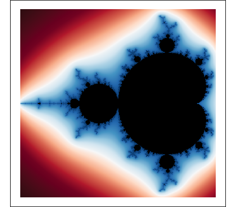

```{r setup, include=FALSE}
knitr::opts_chunk$set(echo = TRUE)
```

## About Course Project
For the final week of the Developing Data Products course on Coursera, I was asked to create a Shiny app using functionality we learned about in the course. I chose to submit a Mandelbrot set viewer I created earlier in the course to learn about the different functionality of Shiny apps including reactivity, interactive plots, and updating based on user input.

## The Mandelbrot Set
* The Mandelbrot set is generated by the quadratic relationship $f_c(z)=z^2+c$. 
* A point $c$ on the complex coordinate plane is said to be in the Mandelbrot set if when the above equation is iterated starting at $z=0$, the sequence $f_c(0), f_c(f_c(0)), \dots$ remains bound in absolute value.

## Mandelbrot Set Coloring {.smaller}
* The aesthetic appeal arises from points that are *not* in the Mandelbrot set. Points are colored according to how many iterations it takes for them to diverge beyond a number. 
* Example: examine a point $c = -.75+.75i$ on the complex plane: 

```{r}
c <- c(-.75 + .75i)
n <- 0
z <- 0
while(n < 1000) {
  z <- z^2 + c
  n <- n+1
  if (abs(z) > 4) break
}
cat(c, "escapes in", n, "iterations.")
```

## Mandelbrot Set Example
* Enjoy! [Mandelbrot Set Viewer](https://rx31wu-nathan-young.shinyapps.io/Mandelbrot_Viewer/)



